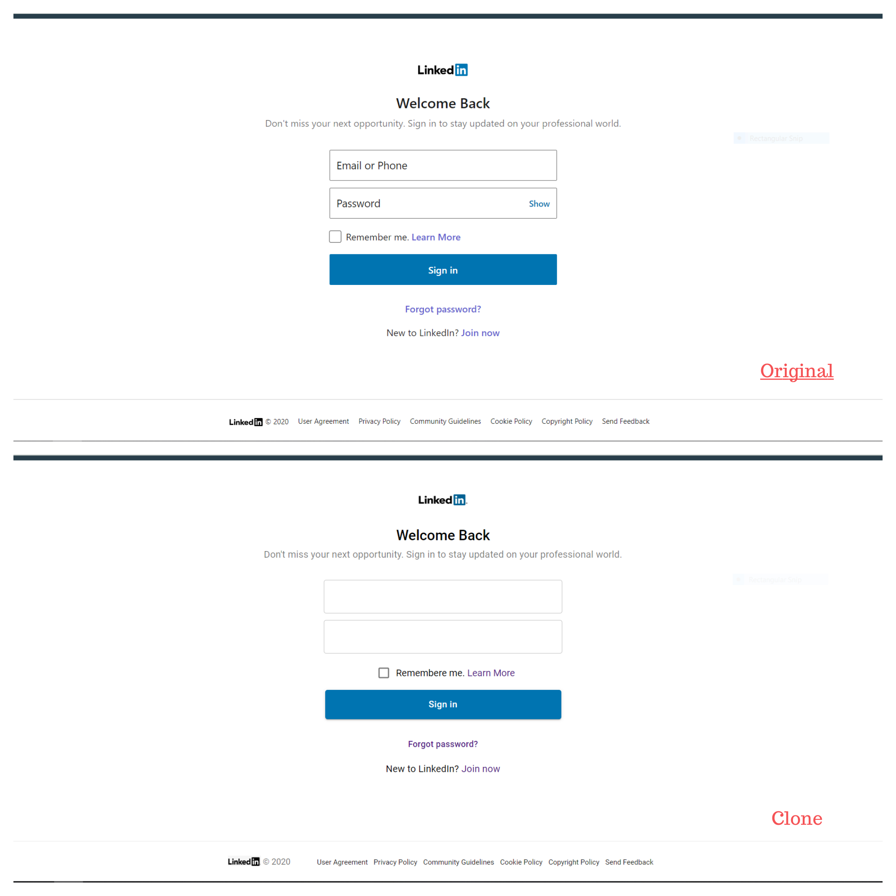

<h1 align="center">
	
</h1>                                                              

<h3 align="center">World's largest professional network website UI clone.</h3>

<h1 align="center">
	
</h1>  
<h2>Introduction</h2>
<p>Basically, I build these project just practise. Already i build 4-5 projects. But <strong>LinkedIn Login page</strong> is my first project build by own without any youtube help.</p>

<h2>Technologies</h2>
<ul>
<li>Reactjs</li>
<li>React Router</li>
<li>Material UI</li>
</ul>

<h2>Launch</h2>

To clone and run this application, From your command line:

```bash
# Clone this repository
$ git clone https://github.com/Ganesh1172/linkedin-ui-clone.git

# install npm packages
$ npm install

#run program using
$ npm start
```

## Support

Show some :heart: and star the repo to support the project. 


